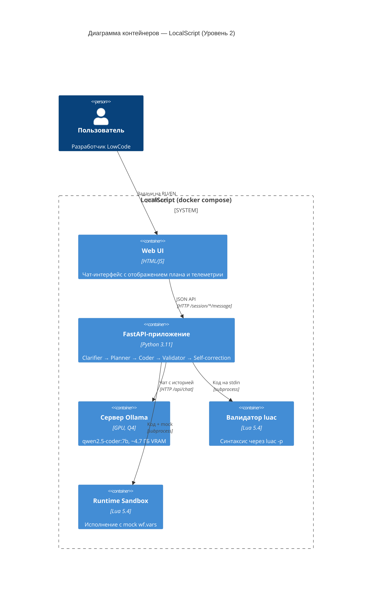
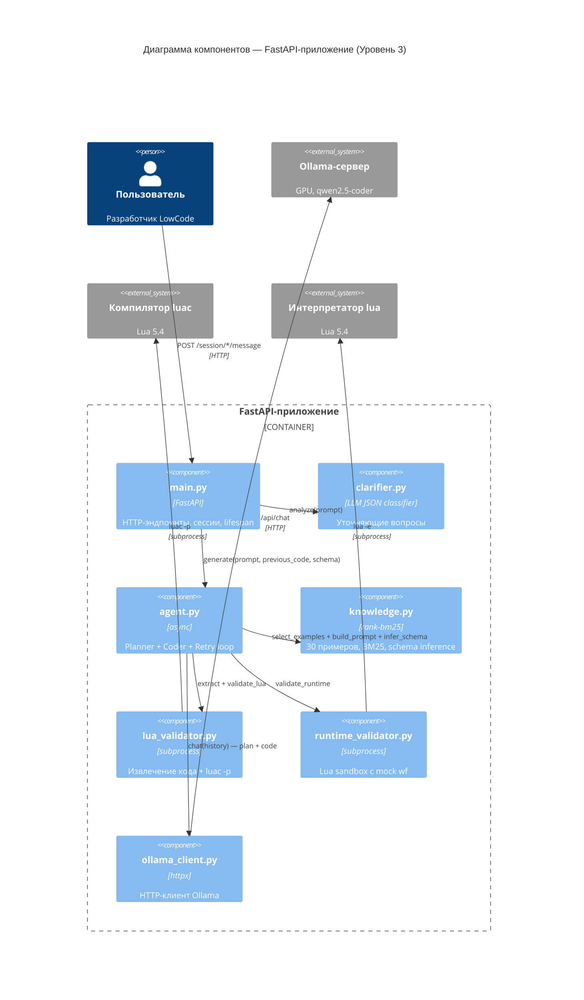
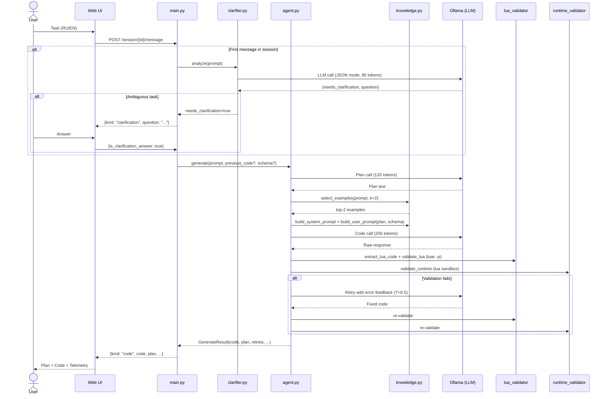

# Архитектура LocalScript (C4-модель)

Документ описывает архитектуру системы **LocalScript** — локального
агентного генератора Lua 5.5-кода для LowCode-платформы — на двух уровнях
модели C4: **Container Diagram (Уровень 2)** и **Component Diagram
(Уровень 3)**. Диаграммы написаны на Mermaid.js и отображаются прямо в
браузере (GitHub, VS Code, MkDocs и т. п.).

Фиксированные параметры запуска жюри: `num_ctx=4096`, `num_predict=256`,
`num_batch=1`, `OLLAMA_NUM_PARALLEL=1`. Пиковое потребление VRAM — ≤ 8 ГБ
(замер через `nvidia-smi` или эндпоинт `/metrics`).

---

## Уровень 2 — Container Diagram (макро-инфраструктура)

Эта диаграмма отражает три главных ограничения хакатона:

1. **100 % локальное исполнение.** На ней нет ни одного облачного сервиса,
   ни одного внешнего API — всё, что нужно пользователю (веб-приложение,
   LLM-движок, валидатор Lua), упаковано в один `docker compose up` и
   работает на его собственной машине. Данные пользователя (промпты,
   сгенерированный код) не покидают хост.
2. **Экономия VRAM < 8 ГБ.** Вместо крупной универсальной модели мы
   держим на GPU один-единственный квантованный `qwen2.5-coder:7b-
   instruct-q4_K_M` (~4.7 ГБ Q4). Контейнер `ollama` запускается с
   директивой `OLLAMA_NUM_PARALLEL=1`, что не даёт движку дублировать
   веса под конкурентные запросы и вписывает систему в лимит 8 ГБ даже
   на RTX 3060 / 4060.
3. **Автономная самокоррекция.** Валидатор `luac` и runtime sandbox —
   это локальные дочерние процессы, которые FastAPI-контейнер запускает
   через `subprocess`. Благодаря этому агент мгновенно (без сетевых
   задержек) получает обратную связь об ошибках и передаёт их обратно
   в LLM внутри одного HTTP-запроса пользователя.

---

## Уровень 3 — Component Diagram (внутренности FastAPI-приложения)

Эта диаграмма показывает, как семь модулей внутри `app/` распределяют
между собой ключевые обязанности агента:

1. **Clarification Agent (`clarifier.py`).** Классификатор на основе
   LLM с `format: "json"` и `num_predict: 80`. Анализирует, достаточно
   ли конкретна задача для генерации, или нужен уточняющий вопрос.
   Безопасные/адверсариальные запросы (`io.open`, JsonPath) никогда не
   триггерят clarification — они идут напрямую к агенту.

2. **Planner (`agent.py::_plan`).** Лёгкий LLM-вызов с `num_predict: 120`,
   генерирующий 2-4 пункта плана перед кодированием. Это chain-of-thought
   для 7B-модели: она лучше генерирует код, когда сначала описывает подход.
   План виден пользователю в UI и API.

3. **BM25 Few-shot Retrieval (`knowledge.py`).** 30 примеров с RU/EN
   ключевыми словами, включая 2 anti-example (JsonPath, sandbox-escape).
   BM25 выбирает top-2 на каждый запрос. Token-budget guard автоматически
   выкидывает лишние примеры, чтобы не превысить `num_ctx=4096`.

4. **Schema Inference (`knowledge.py::infer_schema`).** Если пользователь
   передал `sample_wf_vars`, система рекурсивно обходит структуру и
   генерирует список доступных путей (`wf.vars.response.data.status : string`).
   Это заземляет генерацию — модель перестаёт галлюцинировать поля.

5. **Two-stage Validation.** Синтаксис через `luac -p`, затем runtime через
   `lua` с sandbox-преамбулой (mock `wf.vars`, запрещённые globals = nil).

6. **Self-correction Loop.** До 2 ретраёв с temperature escalation
   (0.1 → 0.5). Ошибки обеих стадий валидации подаются обратно в модель.

7. **Multi-turn Refinement.** Сессионный API хранит историю. Если в
   сессии уже есть код, следующий запрос пользователя трактуется как
   refinement: предыдущий код включается в промпт, и модель модифицирует
   его.

---

## Полный Pipeline (последовательность вызовов)

---

## Связь диаграмм с хакатонными ограничениями (резюме)

| Ограничение жюри | Как решает архитектура | Где видно |
|---|---|---|
| 100 % локальное исполнение | Единый `docker compose`, нет внешних API | Уровень 2: нет систем за границей |
| VRAM ≤ 8 ГБ | Q4 (~4.7 ГБ) + `PARALLEL=1` + BM25 top-2 + token guard + `BASE_OPTIONS` | Уровень 2: ollama; Уровень 3: knowledge + ollama_client |
| Агентность (≥ 1 итерация) | Clarifier → Planner → Coder → Validator → Self-correction → Multi-turn refinement | Уровень 3: все стрелки agent ↔ validator ↔ ollama |
| Уточняющие вопросы | clarifier.py (JSON classifier, fail-open) | Уровень 3: main → clarifier |
| Schema grounding | infer_schema(sample_wf_vars) | Уровень 3: agent → knowledge |
| Lua 5.5 целевой | Модель инструктируется Lua 5.5, валидатор luac 5.4 (совместим) | Уровень 2: luac |
