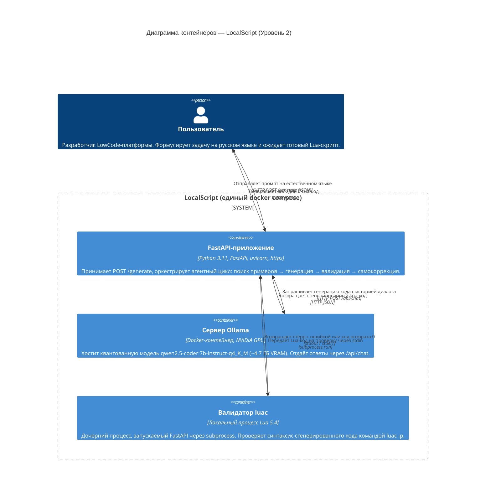
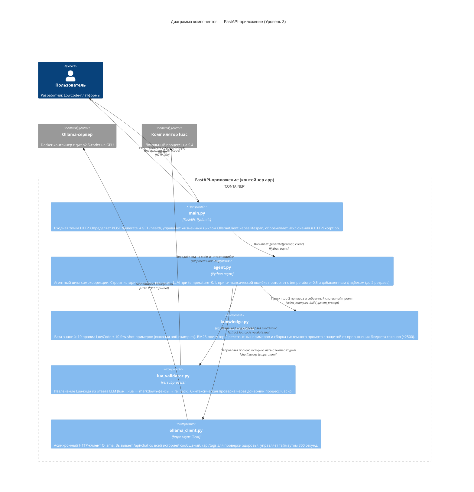

# Архитектура LocalScript (C4-модель)

Документ описывает архитектуру системы **LocalScript** — локального
агентного генератора Lua-кода для LowCode-платформы — на двух уровнях
модели C4: **Container Diagram (Уровень 2)** и **Component Diagram
(Уровень 3)**. Диаграммы написаны на Mermaid.js и отображаются прямо в
браузере (GitHub, VS Code, MkDocs и т. п.).

---

## Уровень 2 — Container Diagram (макро-инфраструктура)

Эта диаграмма отражает три главных ограничения хакатона:

1. **100 % локальное исполнение.** На ней нет ни одного облачного сервиса,
   ни одного внешнего API — всё, что нужно пользователю (веб-приложение,
   LLM-движок, валидатор Lua), упаковано в один `docker compose up` и
   работает на его собственной машине. Данные пользователя (промпты,
   сгенерированный код) не покидают хост.
2. **Экономия VRAM < 8 ГБ.** Вместо крупной универсальной модели мы
   держим на GPU один-единственный квантованный `qwen2.5-coder:7b-
   instruct-q4_K_M` (~4.7 ГБ Q4). Контейнер `ollama` запускается с
   директивой `OLLAMA_NUM_PARALLEL=1`, что не даёт движку дублировать
   веса под конкурентные запросы и вписывает систему в лимит 8 ГБ даже
   на RTX 3060 / 4060.
3. **Автономная самокоррекция.** Валидатор `luac` — это не отдельный
   сервис и не облачный линтер, а локальный дочерний процесс, который
   FastAPI-контейнер запускает через `subprocess`. Благодаря этому
   агент может мгновенно (без сетевых задержек) получить обратную связь
   о синтаксической ошибке и передать её обратно в LLM внутри одного
   HTTP-запроса пользователя.

---

## Уровень 3 — Component Diagram (внутренности FastAPI-приложения)

Эта диаграмма показывает, как пять модулей внутри `app/` распределяют
между собой три ключевые обязанности агента и как именно они удерживают
систему в рамках хакатонных ограничений:

1. **Целевой BM25-поиск против разрастания контекста.** Модуль
   `knowledge.py` держит корпус из 10 few-shot примеров (включая два
   anti-example для JsonPath и sandbox-escape). На каждый запрос BM25
   выбирает только top-2 наиболее релевантных — остальные в системный
   промпт не попадают. Дополнительно `build_system_prompt` считает
   приблизительное число токенов (`chars // 4`) и, если промпт
   приближается к бюджету `MAX_SYSTEM_PROMPT_TOKENS = 2500`, **сам
   выкидывает** лишние примеры, не давая превысить `num_ctx = 4096`
   модели. Это прямой механизм защиты от переполнения VRAM на
   карточках до 8 ГБ.
2. **Автономный цикл самокоррекции.** Модуль `agent.py` держит полную
   `history` из сообщений чата. После первой генерации при
   `temperature = 0.1` результат извлекается через `lua_validator.py`
   (`extract_lua_code` умеет разбирать `lua{...}lua`, markdown-фенсы и
   голый текст) и прогоняется через `validate_lua` → `luac -p`. При
   ошибке цикл добавляет в `history` сломанный ответ ассистента и
   корректирующее сообщение пользователя, поднимает температуру до
   `0.5` и повторяет — до двух раз. Это *в точности* то, что требовал
   хакатон: агент, который сам чинит свои ошибки, без участия человека.
3. **Полная изоляция инфраструктуры от бизнес-логики.** Модуль
   `ollama_client.py` — единственная точка, знающая про HTTP и httpx.
   Модуль `lua_validator.py` — единственная точка, знающая про
   `subprocess` и `luac`. `main.py` не импортирует ни то, ни другое
   напрямую — только `agent.generate(...)`, что делает код легко
   тестируемым и позволяет подменять инфраструктурные зависимости.

---

## Связь диаграмм с хакатонными ограничениями (резюме)

| Ограничение жюри | Как решает архитектура | Где видно на диаграмме |
|---|---|---|
| 100 % локальное исполнение, без облаков | Единый `docker compose`, все контейнеры локальные, `luac` — дочерний процесс | **Уровень 2**: отсутствие внешних систем за границей `System_Boundary` |
| VRAM ≤ 8 ГБ | Квантованная Q4-модель (~4.7 ГБ) + `OLLAMA_NUM_PARALLEL=1` + BM25 top-2 + token-budget guard | **Уровень 2**: `ollama` с GPU; **Уровень 3**: `knowledge.py` с защитой бюджета |
| Автономная самокоррекция | Агентный цикл `generate → validate → retry` с ростом температуры и накоплением истории | **Уровень 3**: стрелки `agent → validator → agent → ollama_client` |
| Изоляция / тестируемость | HTTP живёт только в `ollama_client.py`, subprocess только в `lua_validator.py` | **Уровень 3**: только эти два компонента имеют `Rel` к `System_Ext` |
